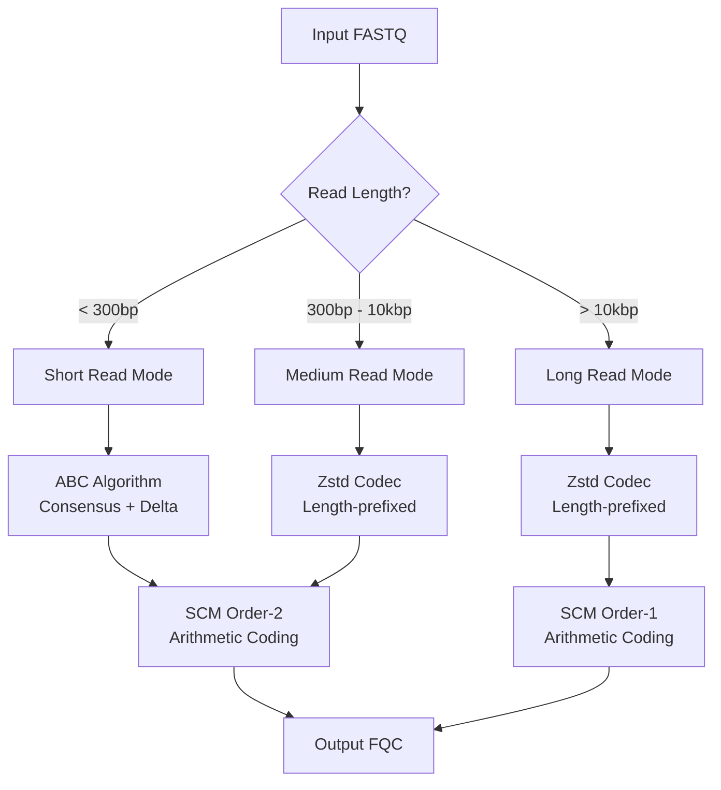

# Algorithms

fqc implements multiple algorithms selected based on read characteristics.

## Algorithm Selection

## ABC Algorithm (Alignment-Based Compression)

For short reads (< 300bp), typically Illumina data.

### Key Insight

NGS reads from the same genomic region are highly similar. ABC exploits this by:

1. **Clustering** similar reads into contigs
2. **Consensus building** per contig
3. **Delta encoding** storing only differences

### Performance

- **Compression ratio**: 3.5-4.5x on Illumina data
- **Speed**: 5-15 MB/s (depends on reordering)
- **Memory**: Higher than Zstd due to reordering

## SCM (Statistical Context Model)

For quality score compression.

### Context Models

| Order | Context | Use Case |
|-------|---------|----------|
| Order-0 | None | Baseline |
| Order-1 | Previous quality | Long reads |
| Order-2 | Previous 2 qualities | Short/medium reads |

Higher order = better prediction = better compression, but requires more memory.

### Arithmetic Coding

- 32-bit precision range coder
- Adaptive frequency tables per context
- Automatic frequency rescaling

## Minimizer Reordering

Pre-processing step for short reads.

### Purpose

Reorder reads so similar sequences are adjacent, improving delta encoding efficiency.

### Algorithm

1. Extract canonical minimizer from each read
2. Sort by minimizer value
3. Generate bidirectional reorder map

### Impact

- **10-30% improvement** in compression ratio
- **Cost**: One full-file read + sort
- **Disabled** in streaming mode

## Zstd Codec

For medium/long reads where ABC is not beneficial.

### Configuration

- Levels 1-19 (default: 3)
- Length-prefixed encoding for variable reads
- Dictionary compression disabled (not beneficial for this data)

## Comparison

| Algorithm | Best For | Ratio | Speed | Memory |
|-----------|----------|-------|-------|--------|
| ABC | Short reads | 4.0x | Medium | High |
| Zstd | Long reads | 3.0x | Fast | Low |
| SCM | Quality scores | 2.5x | Fast | Medium |
